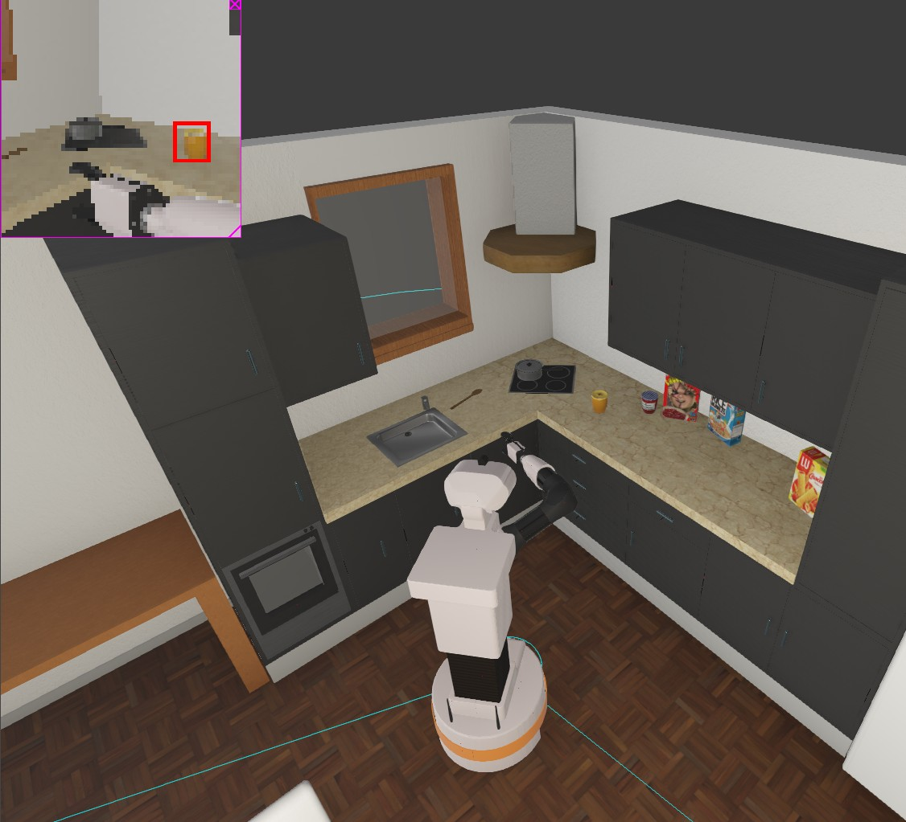

# TIAGo Robot Autonomous Pick-and-Place Controller



## Overview

This repository contains a behavior tree-based autonomous controller for the TIAGo robot, designed to perform pick-and-place operations in a simulated kitchen environment using the Webots simulator. The controller enables the robot to autonomously locate, collect, and transport objects (specifically jars) from a kitchen counter to a designated table.

## Features

- **Behavior Tree Architecture**: Structured task execution using py_trees
- **Computer Vision**: Object recognition with position estimation
- **Inverse Kinematics**: Advanced arm positioning using ikpy
- **Reactive Navigation**: GPS and compass-based waypoint navigation
- **Obstacle Avoidance**: LIDAR-based collision prevention
- **Force-based Grasping**: Gripper control with force feedback monitoring

## System Architecture

The system is built around a hierarchical behavior tree that coordinates the robot's operations:

```
[Root Behavior Tree]
├── [Initialization]
│    ├── Check Hardware Status
│    └── Move to Safe Position
├── [Handle Jar 1]
│    ├── [Find Object]
│    │    ├── Recognize Object 1
│    │    └── Comprehensive Scanner
│    ├── [Approach Sequence]
│    │    ├── Prepare Arm for Approach
│    │    └── Move to Object 1
│    ├── Grasp Object 1
│    └── [Transport and Place]
│         ├── Lift and Verify
│         ├── Backup After Grasp
│         ├── Move to Table Waypoint
│         ├── Place Object
│         ├── Open Gripper
│         ├── Reset Arm For Home
│         └── Move to Home Waypoint
└── [Handle Jar 2/3]
     └── ... (repeats pattern)
```

## Technologies Used

- **Python 3.8+**
- **Webots Simulator**
- **py_trees**: For behavior tree implementation
- **NumPy**: For numerical operations and calculations
- **ikpy**: For inverse kinematics calculations
- **OpenCV**: For computer vision tasks

## Installation

### Prerequisites

- Webots R2023a or later
- Python 3.8+
- TIAGo robot Webots model

### Setup

1. Clone this repository:
   ```bash
   git clone https://github.com/yourusername/tiago-pick-place-controller.git
   cd tiago-pick-place-controller
   ```

2. Install required Python dependencies:
   ```bash
   pip install numpy py_trees ikpy opencv-python
   ```

3. Copy the controller to your Webots projects directory or set up the WEBOTS_HOME environment variable to point to this repository.

## Usage

1. Open the provided Webots world file:
   ```bash
   webots worlds/tiago_kitchen.wbt
   ```

2. The controller will automatically start when the simulation begins. The TIAGo robot will:
   - Initialize and check hardware
   - Locate jars on the counter
   - Navigate to and grasp each jar
   - Transport jars to the designated table
   - Return to its home position

## Code Structure

- **`final_controller.py`**: Main controller file
- **`behavior_tree/`**: Behavior tree implementation
  - **`__init__.py`**: Package initialization
  - **`tree_factory.py`**: Behavior tree creation
  - **`behaviors/`**: Individual behavior implementations
    - **`recognition.py`**: Object recognition behaviors
    - **`navigation.py`**: Navigation behaviors
    - **`manipulation.py`**: Grasping and manipulation behaviors
- **`utils/`**: Utility functions
  - **`kinematics.py`**: Inverse kinematics calculations
  - **`sensor_fusion.py`**: Sensor data processing
  - **`vision.py`**: Computer vision functions

## Key Implementation Details

### Sensor Fusion System

The controller integrates multiple sensor inputs to accurately perceive the environment:

```python
def camera_to_world_coordinates(camera_position, camera_offset=0.0):
    """Converts camera-relative coordinates to global world coordinates"""
    # Get robot's current position and orientation
    robot_pos = gps.getValues()
    compass_val = compass.getValues()
    robot_angle = np.arctan2(compass_val[0], compass_val[1])
    
    # Calculate precise camera height with torso lift
    camera_height = robot_pos[2] + 0.891 + torso_height
    
    # Apply height correction based on empirical observations
    z_correction = 0
    if torso_height > reference_torso_height:
        height_diff = torso_height - reference_torso_height
        z_correction = -1.87 * height_diff
```

### Object Recognition

The system includes multiple strategies for object recognition:

```python
class EnhancedObjectRecognizer(py_trees.behaviour.Behaviour):
    """
    Computer vision-based object detection and localization behavior.
    
    Features:
    - Multi-sample averaging for position stability
    - Timeout handling
    - Blackboard integration for cross-behavior communication
    - Automatic coordinate conversion to world frame
    """
```

When direct recognition fails, a comprehensive scanning approach is used:

```python
class ComprehensiveScanner(py_trees.behaviour.Behaviour):
    """Systematic environment scanning for object discovery"""
    # 8 distinct angles, 45° between positions
    # Includes head positioning for optimal visibility
    # 360° visual scanning for difficult-to-detect objects
    # Camera orientation optimization with head tilt adjustment
```

### Reactive Obstacle Avoidance

The controller includes LIDAR-based collision prevention:

```python
class LidarObstacleAvoidance(py_trees.behaviour.Behaviour):
    """Uses Lidar to detect and avoid obstacles reactively"""
    
    def update(self):
        # Define sectors within the valid range
        sector_width = (valid_end - valid_start) // 5  # 5 sectors across valid FOV
        
        # Calculate minimum distances in each sector
        center_distance = min(center_readings) if center_readings else float('inf')
        left_distance = min(left_readings) if left_readings else float('inf')
        right_distance = min(right_readings) if right_readings else float('inf')
        
        # Determine avoidance direction based on obstacle locations
        if center_distance < self.safety_distance:
            if right_distance > left_distance:
                # Turn right when obstacle is ahead and right has more space
                leftMotor.setVelocity(self.max_speed * 0.7)
                rightMotor.setVelocity(-self.max_speed * 0.4)
```

## Performance

The controller achieves:
- Object recognition accuracy: >95%
- Grasp success rate: 100%
- Navigation accuracy: ±0.08m
- Path efficiency: ~85-90% (displacement/total distance)
- Full task completion time: ~120s

## Contributing

Contributions are welcome! Please feel free to submit a Pull Request.

1. Fork the repository
2. Create your feature branch (`git checkout -b feature/amazing-feature`)
3. Commit your changes (`git commit -m 'Add some amazing feature'`)
4. Push to the branch (`git push origin feature/amazing-feature`)
5. Open a Pull Request

## License

This project is licensed under the MIT License - see the [LICENSE](LICENSE) file for details.

## Acknowledgments

- The PAL Robotics team for the TIAGo robot platform
- The Webots team for their excellent robot simulator
- The py_trees team for the behavior tree framework

## Contact

Panagiotis Georgiadis - [pgeorgiadis.it@gmail.com](mailto:pgeorgiadis.it@gmail.com) - [Personal Website](https://pgcloud.dev)
