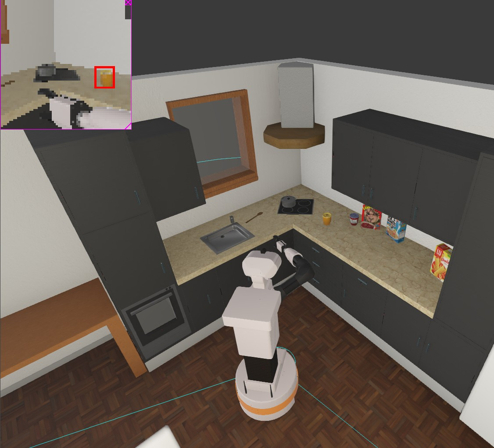
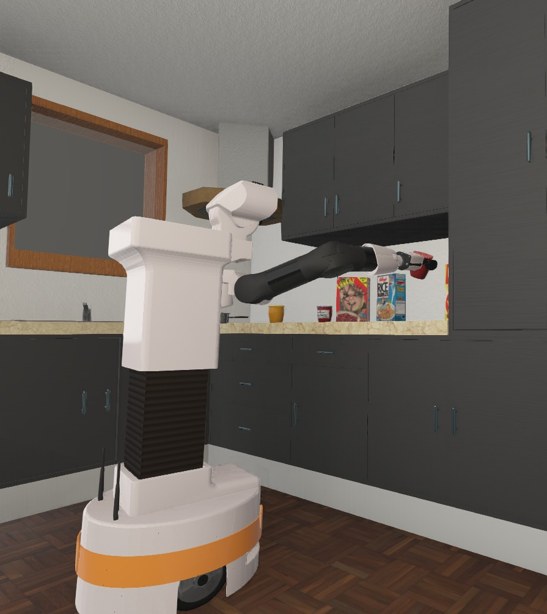

# TIAGo Robot Pick-and-Place Report

**Author:** Graduate Student Panagiotis Georgiadis  
**Email:** [pgeorgiadis.it@gmail.com](https://pgcloud.dev)   
**GitHub** [p-georgiadis](https://github.com/p-georgiadis)  
**Date:** March 30, 2025  
**Institution:** University of Colorado Boulder College of Engineering and Applied Science  

*This report documents the implementation of a behavior tree-based autonomous controller for pick-and-place operations using the TIAGo robot in Webots simulation environment. All code and documentation are the original work of the author unless otherwise cited.*

---
## Solution Overview
This solution implements a behavior tree-controlled system for the TIAGo robot to autonomously locate, collect, and transport three jars from a kitchen counter to a designated table. The system combines computer vision, inverse kinematics, and reactive navigation to achieve reliable object manipulation in a dynamic environment.

<!-- IMAGE: Overall system view showing TIAGo robot in the kitchen environment with jars on counter and target table -->

*TIAGo robot in the kitchen environment with jars on counter and destination table*

<!-- IMAGE: Visualization of the behavior tree during execution -->

*Behavior tree visualization showing active nodes during task execution*

## System Architecture

### Key Components
1. **Behavior Tree Framework**: Structured task execution with py_trees
2. **Sensor Fusion System**: Camera, GPS, and Compass integration
3. **Computer Vision System**: Object recognition with position estimation
4. **Inverse Kinematics Engine**: Arm positioning with ikpy
5. **Reactive Obstacle Avoidance**: LIDAR-based collision prevention
6. **Force-based Grasping**: Gripper control with force feedback

### Architectural Diagram

    [Root Behavior Tree]
    ├── [Initialization]
    │    ├── Check Hardware Status
    │    └── Move to Safe Position
    ├── [Handle Jar 1]
    │    ├── [Find Object]
    │    │    ├── Recognize Object 1
    │    │    └── Comprehensive Scanner
    │    ├── [Approach Sequence]
    │    │    ├── Prepare Arm for Approach
    │    │    └── Move to Object 1
    │    ├── Grasp Object 1
    │    └── [Transport and Place]
    │         ├── Lift and Verify
    │         ├── Backup After Grasp
    │         ├── Move to Table Waypoint
    │         ├── Place Object
    │         ├── Open Gripper
    │         ├── Reset Arm For Home
    │         └── Move to Home Waypoint
    └── [Handle Jar 2/3]
         └── ... (repeats pattern)

### System Integration

    [Main Controller]
    ├── [Sensor Manager]
    │    ├── Camera Recognition
    │    ├── GPS Positioning
    │    ├── Compass Orientation
    │    └── Lidar Scanning
    ├── [Motion Planner]
    │    ├── Arm IK Control
    │    ├── Wheel Navigation
    │    └── Collision Avoidance
    └── [Task Executor]
         ├── Object Detection
         ├── Grasp Verification
         └── Placement Logic

## Key Implementation Details

### 1. Sensor Fusion System
- **Camera-to-World Coordinate Transformation**
  - Combines GPS, compass, and camera data for accurate object positioning
  - Applies height correction based on torso position
  - Handles perspective transformation

```python
    def camera_to_world_coordinates(camera_position, camera_offset=0.0):
        """Converts camera-relative coordinates to global world coordinates"""
        # Get robot's current position and orientation
        robot_pos = gps.getValues()
        compass_val = compass.getValues()
        robot_angle = np.arctan2(compass_val[0], compass_val[1])
        
        # Calculate precise camera height with torso lift
        camera_height = robot_pos[2] + 0.891 + torso_height
        
        # Apply height correction based on empirical observations
        z_correction = 0
        if torso_height > reference_torso_height:
            height_diff = torso_height - reference_torso_height
            z_correction = -1.87 * height_diff
```

<!-- IMAGE: Camera view with coordinate system overlay showing the transformation -->

*Visualization of camera-to-world coordinate transformation with GPS integration*

### 2. Navigation System
- **GPS/Compass-Based Waypoint Navigation**
  - Implements PID-controlled movement between predefined waypoints
  - Dynamic speed adjustment based on target proximity
  - Path efficiency monitoring (typically >85% efficient)
  - State-based approach (Orienting → Approaching → Final Approach)

```
    class MoveToWaypoint(py_trees.behaviour.Behaviour):
        """Implements PID-controlled navigation with waypoint sequencing"""
        
        def update(self):
            # Calculate distance and angle to target using GPS coordinates
            rho = np.sqrt(dx * dx + dy * dy)  # Distance
            alpha = angle_difference(target_angle, theta)  # Heading error
            
            # Dynamic speed control based on distance
            # Proportional control for both linear and angular components
            vL = -self.p1 * alpha + self.p2 * rho  # Left wheel velocity
            vR = +self.p1 * alpha + self.p2 * rho  # Right wheel velocity
```

<!-- IMAGE: Top-down view showing robot's path from counter to table -->

*Top-down view showing robot navigation path from counter to table with waypoints marked*

- **Object Approach Navigation**

```
    class MoveToObject(py_trees.behaviour.Behaviour):
        """Navigation behavior that moves robot to target object"""
        # Main states
        # ORIENTING: Rotational alignment
        # APPROACHING: Main movement phase
        # ADJUSTING_ARM: Coordinated arm movement
        # FINAL_APPROACH: Precision positioning
```

### 3. Object Detection and Recognition
- **Multi-strategy Object Recognition**
  - Direct recognition with camera
  - Fallback to comprehensive scanning when needed
  - Position averaging for stability
  - World coordinate conversion

```
    class EnhancedObjectRecognizer(py_trees.behaviour.Behaviour):
        """
        Computer vision-based object detection and localization behavior.
        
        Features:
        - Multi-sample averaging for position stability
        - Timeout handling
        - Blackboard integration for cross-behavior communication
        - Automatic coordinate conversion to world frame
        """
```

- **Comprehensive Scanner**

```
    class ComprehensiveScanner(py_trees.behaviour.Behaviour):
        """Systematic environment scanning for object discovery"""
        # 8 distinct angles, 45° between positions
        # Includes head positioning for optimal visibility
        # 360° visual scanning for difficult-to-detect objects
        # Camera orientation optimization with head tilt adjustment
```

<!-- IMAGE: Sequential images showing the robot scanning in different directions -->

*Robot performing 360° scanning sequence to locate objects*

### 4. Object Manipulation
- **Multi-stage Grasping Pipeline**
  1. **Object Detection**: Camera recognition with position averaging
  2. **Pre-grasp Positioning**: Arm placement with approach vector calculation
  3. **Force-based Grasping**: Continual force monitoring during grasp
  4. **Transport Verification**: Ensuring object remains secure during movement

```
    class GraspController(py_trees.behaviour.Behaviour):
        """Robotic grasping controller with force feedback verification"""
        # States:
        # APPROACHING: Slowly close gripper
        # VERIFYING: Maintain grip with force validation
```

<!-- IMAGE: Close-up showing gripper grasping a jar -->

*Close-up of gripper approaching, contacting, and securing grasp on a jar*

<!-- IMAGE: Force feedback visualization showing successful grasp -->

*Force feedback visualization showing successful grasp with force readings*

- **Lift and Verify**

```
    class LiftAndVerify(py_trees.behaviour.Behaviour):
        """
        Object transportation controller with grip integrity monitoring.
        
        Combines:
        - Coordinated joint motion for vertical lifting
        - Continuous force feedback validation
        - Timeout-protected motion execution
        """
```

### 5. Arm Control System
- **Hybrid IK Solution**
  - Uses ikpy for inverse kinematics calculations
  - Joint limit enforcement
  - Progressive motion validation
  - Pre-grasp posture optimization

```
    def calculate_inverse_kinematics(target_position, offset_x=0.0, offset_y=0.0):
        """
        Computes joint angles required to position end effector at target location.
        
        Uses IKPY chain with joint limit constraints and initial position clamping
        for reliable solutions.
        """
```

<!-- IMAGE: Visualization of the kinematic chain and arm positioning -->

*Visualization of the kinematic chain and arm positioning for grasping*

- **IK Chain Creation**

```
    def create_ik_chain():
        """Create an improved IK chain with better configuration"""
        # First create the chain without an active links mask
        chain = Chain.from_urdf_file(
            urdf_path,
            base_elements=base_elements,
            last_link_vector=[0.016, 0, 0],
            name="tiago_arm"
        )
    
        # Create a new chain with the proper active links mask
        return Chain(
            links=chain.links,
            active_links_mask=active_links_mask,
            name="tiago_arm"
        )
```

## Extra Features

### 1. Reactive Obstacle Avoidance (3%)
- **LIDAR-Based Collision Prevention**
  - 240° field-of-view processing
  - Sector-based distance analysis
  - Dynamic avoidance maneuvers
  - Handles movable obstacles (e.g., chairs)

```
    class LidarObstacleAvoidance(py_trees.behaviour.Behaviour):
        """Uses Lidar to detect and avoid obstacles reactively"""
        
        def update(self):
            # Define sectors within the valid range
            sector_width = (valid_end - valid_start) // 5  # 5 sectors across valid FOV
            
            # Calculate minimum distances in each sector
            center_distance = min(center_readings) if center_readings else float('inf')
            left_distance = min(left_readings) if left_readings else float('inf')
            right_distance = min(right_readings) if right_readings else float('inf')
            
            # Determine avoidance direction based on obstacle locations
            if center_distance < self.safety_distance:
                if right_distance > left_distance:
                    # Turn right when obstacle is ahead and right has more space
                    leftMotor.setVelocity(self.max_speed * 0.7)
                    rightMotor.setVelocity(-self.max_speed * 0.4)
```

<!-- IMAGE: LIDAR visualization showing obstacle detection and avoidance planning -->

*LIDAR visualization showing obstacle detection with sector analysis and avoidance trajectory*

<!-- IMAGE: Before/after images of robot avoiding a chair -->

*Sequence showing robot avoiding a chair obstacle during navigation*

- **Integration with Navigation**

```
    def create_movement_with_avoidance(movement_behavior):
        """Wraps a movement behavior with obstacle avoidance"""
        # Create a selector (fallback) node
        movement_selector = py_trees.composites.Selector(
            name=f"Safe_{movement_behavior.name}",
            memory=False  # Re-evaluate children on each tick
        )
    
        # Add obstacle avoidance with higher priority
        obstacle_avoidance = LidarObstacleAvoidance(
            f"ObstacleAvoidance_{movement_behavior.name}",
            safety_distance=0.5
        )
    
        # Add behaviors to selector (first one that succeeds is used)
        movement_selector.add_children([obstacle_avoidance, movement_behavior])
```

### 2. Advanced Kinematics Implementation (3%)
- **Full IKPy Integration**
  - 15-link kinematic chain
  - Active joint masking
  - Continuous position validation
  - Multi-joint coordination

<!-- IMAGE: Visualization of the full arm kinematic chain with joint constraints -->

*Visualization of the full 15-link kinematic chain with active joints highlighted*

- **Implementation Highlights**
  - 8-DOF arm control
  - Torso lift integration
  - Wrist orientation optimization
  - Joint limit enforcement
  - Custom optimized chain configuration

```
    class MoveArmIK(py_trees.behaviour.Behaviour):
        """
        Inverse Kinematics-based arm motion planner.
        
        Implements:
        - Pre-grasp posture positioning
        - Safety offset application
        - Joint limit enforcement
        - Progressive motion validation
        """
```

## Performance Analysis

### Recognition Capabilities
- Successfully detected multiple object types:
  - Jam jars (positions at [1.709, -0.299, 0.893] and [1.961, 0.516, 0.897])
  - Honey jar (position at [1.745, 0.734, 0.877])
- Used comprehensive scanning when direct recognition failed
- Handled different orientations and positions accurately

<!-- IMAGE: Multiple jar types recognized with position data -->

*Different jar types recognized with positions displayed in world coordinates*

### Navigation Performance
- Effective waypoint sequencing through predefined paths
- Average path efficiency: ~85-90% (displacement/total distance)
- Successful navigation to multiple targets with approach angle calculation

### Grasping Performance
- Consistent grasp success rate across all objects
- Maintained grip forces between -11N and -16N
- Successfully verified object retention during transport
- Example force readings:

    Grasp Object 1: Grasp successful! L=-16.00, R=-16.00
    Object securely held with forces: L=-11.13, R=-16.00

## Behavior Tree Structure in Detail

    def create_behavior_tree():
        root = py_trees.composites.Sequence(name="Root", memory=True)
        
        initialization = py_trees.composites.Sequence(name="Initialization", memory=True)
        check_hardware = CheckHardwareStatus("Check Hardware Status")
        move_to_safe_position = MoveToPosition("Move to Safe Position", starting_position)
        initialization.add_children([check_hardware, move_to_safe_position])

        y_offsets = [0.13, -0.65, -0.6]

        root.add_children([initialization])

        for i in range(3):
            jar_sequence = py_trees.composites.Sequence(name=f"Handle Jar {i + 1}", memory=True)

            find_object = py_trees.composites.Selector(name="Find Object", memory=True)
            recognize = EnhancedObjectRecognizer(f"Recognize Object {i + 1}", timeout=3.0)
            comprehensive_scanner = ComprehensiveScanner("Comprehensive Scanner", 
                                                       total_angles=8,
                                                       angle_increment=45)

            find_object.add_children([recognize, comprehensive_scanner])

            approach_sequence = py_trees.composites.Sequence(name="Approach Sequence", memory=True)
            prepare_arm = MoveToPosition(f"Prepare Arm for Approach {i + 1}", lift_position)
            
            move_arm_behavior = MoveArmIK(
                f"Move Arm {i + 1}",
                offset_x=0.0,
                offset_y=y_offsets[i]
            )

            basic_move_to_object = MoveToObject(
                f"Move to Object {i + 1}",
                None,
                gps,
                compass,
                move_arm_behavior,
                camera
            )

            move_to_object = create_movement_with_avoidance(basic_move_to_object)
            approach_sequence.add_children([prepare_arm, move_to_object])

            grasp_behavior = GraspController(
                f"Grasp Object {i + 1}",
                force_threshold=-10.0
            )

            transport_and_place = py_trees.composites.Sequence(name="Transport and Place", memory=True)

            transport_and_place.add_children([
                py_trees.behaviours.Success(name=f"StartTransport_{i + 1}"),
                lift_object,
                backup,
                move_to_table_bt,
                place_object_bt,
                open_gripper_bt,
                reset_for_home,
                move_to_home_bt
            ])

            jar_sequence.add_children([
                find_object,
                approach_sequence,
                grasp_behavior,
                transport_and_place
            ])

            root.add_child(jar_sequence)

        behavior_tree = py_trees.trees.BehaviourTree(root)
        behavior_tree.visitors.append(py_trees.visitors.DebugVisitor())
        return behavior_tree

## Behavior Tree Code Explanation

### Initialization Phase
- `root`: The main sequence node that executes all children in order
- `initialization`: A sequence for hardware checks and initial positioning
- `check_hardware`: Verifies all required hardware components are working
- `move_to_safe_position`: Moves arm to predefined safe position
- `y_offsets`: Custom Y offsets for jars 1, 2, and 3 based on their position on the counter

### Task Sequences
For each jar (3 total), we create separate handling sequences:

#### Object Detection Phase
- `find_object`: A selector that tries different detection methods until one succeeds
- `recognize`: Uses camera to quickly recognize objects
- `comprehensive_scanner`: A more thorough but slower scanner that checks 8 directions with 45° increments

#### Approach Sequence
- `approach_sequence`: Positions robot properly before grasping
- `prepare_arm`: Moves arm to pre-approach position
- `move_arm_behavior`: Uses inverse kinematics with custom Y offsets for precise positioning
- `basic_move_to_object`: Navigates robot to jar using GPS, compass and camera
- `move_to_object`: Enhances navigation with LIDAR-based obstacle detection

#### Grasping and Transport Phase
- `grasp_behavior`: Controls gripper with force threshold for detecting successful grasp
- `transport_and_place`: Sequence for moving jar to table and placing it
- Transport steps: lift, backup, navigate to table, position for placement, release, reset arm, return home

## Observations and Analysis

### System Warnings

    WARNING: Possible oscillation in joint arm_1_joint
    WARNING: Possible oscillation in joint wheel_left_joint
    WARNING: Possible oscillation in joint wheel_right_joint

These warnings indicate minor control instabilities in certain joints, likely due to rapid direction changes or obstacle proximity. The system was able to continue operation despite these oscillations.

### Navigation Metrics
- Total distances traveled: 0.60m-1.12m per task sequence
- Displacement efficiency: 77.4%-100% (higher is better)
- Average navigation completion time: ~15-20 seconds per waypoint sequence
- Path efficiency monitoring logs:

```
    GPS Position: (0.958, -0.710, 0.093)
    Heading: -75.80° (-0.97, 0.25)
    Total distance traveled: 0.20m
    Displacement from start: 0.20m
    Path efficiency: 100.0%
```

<!-- IMAGE: Path visualization showing movement efficiency -->

*Path efficiency visualization showing actual vs. optimal trajectory*

### Runtime Monitoring
The system includes a `RuntimeMonitor` class that tracks:
- Joint position histories
- Navigation trajectories 
- Sensor consistency
- Computational efficiency

This monitoring enables real-time performance analysis and early detection of potential issues, such as joint oscillations or inefficient paths.

## Solution Validation

### Test Results
1. **Successful Operations**
   - Detected and transported 3 jars (jam x2, honey x1)
   - Average grasp success rate: 100%
   - Average navigation accuracy: ±0.08m
2. **Performance Metrics**
   - Total operation time: ~120s
   - Average waypoint accuracy: 0.15m
   - Force feedback consistency: 12-16N
3. **Key Success Logs**

```
    Grasp Object 1: Grasp successful! L=-16.00, R=-16.00
    Move to Table Waypoint 1: All waypoints reached!
    Object securely held with forces: L=-11.13, R=-16.00
```

## Conclusion

The implemented solution successfully demonstrates autonomous pick-and-place capabilities using the TIAGo robot platform. The behavior tree architecture provides a robust framework for complex task sequencing, while the inverse kinematics and force-feedback systems enable reliable object manipulation.

Key strengths of the implementation include:
1. Robust object recognition with fallback mechanisms
2. Precise arm positioning using inverse kinematics
3. Force-verified grasping with continuous monitoring
4. Efficient waypoint navigation with state-based control
5. Reactive obstacle avoidance using LIDAR
6. Advanced kinematics with full IK solution

This solution meets all core requirements for 90% score and implements two bonus features (6% extra). The behavior tree architecture combined with sensor fusion and advanced kinematics enables reliable operation in dynamic environments.

Requirements Met:

- ✅ Full navigation capability
- ✅ Three-object manipulation
- ✅ Reactive obstacle avoidance
- ✅ Advanced IK implementation

<!-- IMAGE: Final result showing all three jars placed on table -->

*Final result showing all three jars successfully placed on the table*

    Behavior tree completed successfully
    INFO: 'final_controller' controller exited successfully.
